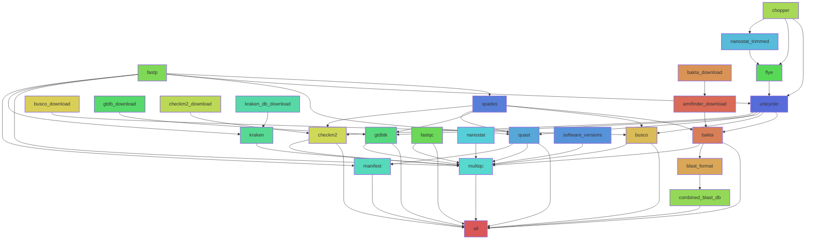

# BugBuilder II

[](https://doi.org/10.5281/zenodo.19420867)

This workflow is intended to carry out either a short read, or hybrid assembly
(combining long and short reads) of a number of microbial genomes, using a range
of well known software tools. Appropriate assembly tools will be selected
automatically based upon the read types available for each sample. It is
implemented using Snakemake, and aims to provide a 'hands-free' processes from
raw reads through to submission-ready annotated, classified genome assemblies,
optionally generating MANIFEST files required for ENA submission. 

The workflow is also created with reprodicibility in mind, using defined
versions of software provided via Docker, while clearly reporting all versions
of software used, which should be cited in any publications utilising it's
outputs.

The software requires a number of databases, which will be automatically
downloaded as required. Note that these will require ~650 Gb disk space. 

TODO: Use centralised database and docker cache directories to ease reuse

## Quick start guide for those familiar with git and pixi

Note that the configuration is currently configured to use a GridEngine based
compute cluster with DRMAA. Changes will probably be required to support other
environments, which will need to be made in the Snakemake `profile/config.yaml`.

1. Clone this repository and change into the resulting directory

2. Recreate the software environment: `pixi install`

3. Setup your data. Create a `data` subdirectory, within which a directory for
each sample (named with the sample name) should be created. Sequence reads
should be placed in directories within these per-sample directories named
'short_reads' and (optionally) 'long_reads', as illustrated below.

```
data
├── NRS2102
│   └── short_reads
│       ├── NRS2102_1.fastq.gz
│       └── NRS2102_2.fastq.gz
├── NRS2103
│   ├── long_reads
│   │   └── NRS2103.fastq.gz
│   └── short_reads
│       ├── NRS2103_1.fastq.gz
│       └── NRS2103_2.fastq.gz
```

5. Tweak the configuration: See workflow configuration below

6. Run the workflow: `pixi run ./run.sh`

## Installation - the long version

A separate copy of the workflow should be created for each analysis to be
conducted. Pixi is used for creating the softawre environment containing the
core packages required for executing the workflow.

The workflow has been implemented and tested on Linux. It may work on MacOS, but
is untested.  YMMV...

1. **Software Prerequisites**: Ensure you have git and (preferably) pixi or
conda available. If you don't have pixi, head
[here](https://docs.conda.io/en/latest/) to obtain the appropriate downoader for
your platform, and follow it's installation instructions. You probably want the
mambaforge installer rather than miniforge, which has commercial licensing
implications

2. **Clone this repository**: Select a directory name to save this to, and clone
the repository with `git clone https://github.com/bartongroup/BugBuilder_II.git
my_workflow_dir`

3. **Change into the checkout directory**: `cd my_workflow_dir`

4. **Create the conda environment** This creates the environment containing the
necessary workflow software: `pixi install`. Alternatively, for conda, run
`conda env create -f etc/conda.yaml`.

### Workflow Directory Structure and Configuration

The workflow follows old-fashion Unix conventions for directory naming. The only script needing running directly is the `run.sh` script, which starts the process going, once setup and configured. 
```
.
├── bin
│   ├── download_busco_lineages.py
│   ├── download_gtdbtk_db.py
│   ├── download_krakendb.py
│   └── run_workflow.sh
├── etc
│   ├── conda.yaml
│   └── multiqc.conf
├── log
├── profile
│   └── config.yaml
├── README.md
├── rulegraph.svg
└── workflow
    ├── config
    │   └── config.template
    └── Snakefile
```

Minimal files are likely to require editing. The `profile/config.yaml` may need adjusting to match your compute environment. Each workflow run requires a `workflow/config/config.yaml` to be created based upon the provided `config.template` file. See below for details.

## Usage

1. **Activate the environment** This will make the software in the installed environment available: `conda activate BugBuilder_II

2. **Setup sequence read directory** Create a `data` subdirectory, within which a directory for each sample (named with the sample name) should be created. Sequence reads should be placed in directories within these per-sample directories named 'short_reads' and (optionally) 'long_reads', as illustrated below.

```
data
├── NRS2102
│   └── short_reads
│       ├── NRS2102_1.fastq.gz
│       └── NRS2102_2.fastq.gz
├── NRS2103
│   ├── long_reads
│   │   └── NRS2103.fastq.gz
│   └── short_reads
│       ├── NRS2103_1.fastq.gz
│       └── NRS2103_2.fastq.gz
```
3. **Register with ENA** To ensure the workflow outputs can be submitted to ENA with minimal additional work, pre-register your study and samples with the ENA, and upload your sequence reads. Ensuring you register a locus_tag for each sample - We normally use the isolate name as the locus tag, which is the approach taken by the workflow. So far we haven't had any problems with name conflicts with the locus tags. 

4. **Create a config.yaml file for the run**. Copy `workflows/config/config.template` to `workflows/config/config.template` and edit to set the required parameters:

    * project_id: The project identifier issued by ENA i.e. PRJNAXXXXX
    *   short_read_instrument: Type of instrument used for short-read sequencing i.e. Illumina MiSeq
    * long_read_instrument: Type of instrument used for long-read sequencing i.e. Oxford Nanopore GridION
    * genome_size: Estimated average size of genomes in bp. This is required by some assemblers
    * gram: '+' for gram positive organisms, or '-' for gram negative. This is used by the bakta annotation software to better target gene annotations to the type of bacteria.
    * gtdb_version: Version of GTDB database to use (default: 226)
    * kraken_db_version: Version of Kraken standard database to use (default: 20260226)

5. **Manifest files** (optional): If you would like to automatically generate manifest files for use in submitting assemblies to ENA, once you have your read data submitted (stage 3 above), navigate your browser to the Webin [runs report](https://www.ebi.ac.uk/ena/submit/webin/report/runs;defaultSearch=true) page and click the `Download all results` link. Repeat this for the [samples report](https://www.ebi.ac.uk/ena/submit/webin/report/samples;defaultSearch=true), and ensure the files are named `runs.csv` and `samples.csv`, and place them in the `workflow/config` directory. These will be used when populating data in the manifest files.

5. **Run the workflow**. Run `bin/run_workflow.sh` to start the workflow running. It will hopefully run to completion without any problems. Note that database downloads can take a considerable time.

## Workflow Structure

The workflow progresses through a number of stages for each sample, as indicated in the figure below. Some tools require access to local copies of databases, which will be automatically downloaded if necessary.

Should any runtime parameters need changing, these can be altered in the appropriate rule in `workflow/Snakemake`. 

* **Read Preprocessing** Sequence reads are initially assessed for quality and filtered as follows;
    * Short reads: Quality assessment is carried out using FastQC (which offers some metrics which fastp does not), with fastp used for read trimming. Read quality and length trimming with fastp are disabled, since the subsequent SPAdes assembler carries out error correction, for which 'raw' reads are preferred. 

    * Long reads: Chopper is used for quality trimming, with a minimum mean read quality of 10, and minimum read length of 1000. Quality assessment is carried out using NanoStat.

* **Read Classification**: Kraken2 is run on samples to aid in identifying the presence of any contamination within samples

* **Assembly**

    * Short reads: SPAdes is used, with the mode selected according to available sequence coverage. If coverage exceeds 100, then `isolate` mode is used, otherwise `careful` mode is preferred. 

    * Hybrid: If long reads are also available, then a hybrid assembly is carried out. A long-read only assembly is first created using Flye, and provded to Unicycler along with the read sequences to create the hybrid assembly. Unicycler is run in `bold` mode, which favours contiguity possibly at the cost of misassemblies. More conservative `normal` or `conservative` options can be used by editing the `unicycler` rule in `workflow/Snakefile`.

    * Annotation: Annotations are carried out using bakta. The sample name (taken from the name of the directory containing the samples read data) is used as the locus tag. The default setup is for gram positive bacteria, which can be changed with the `gram` parameter in the `config\config.yaml` file.

    * BLAST indexing: BLASt databases are created for ease isolate, with a nucleotide database of the genome sequence, along with a protein database of the Bakta protein predictions. An alias database is also created including all genome or protein sequences for the analysed samples, named 'assemblies'

    * Assembly assessment: QUAST is used to collect contiguity statistics, while checkm2 is used to identify predicted completeness and percentage contamination. BUSCO (with automatic lineage selection) enables estimation of the representation of the coding space of the genome through identification of evolutionarily selected single copy orthologs. 

    * Taxonomic classification: GTDB-Tk provides taxonomic classification through a combination of ANI and placing samples on the taxonomic tree using pplacer.

    * MultiQC: An HTML MultiQC report is generated to provide a summary of the various outputs generated. This is available following completion of the workflow in `workflow/reports/multiqc.html`. A section at the bottom of the report summarises the versions of all software packages used throughout the workflow.



## Workflow Outputs

All  outputs are placed in a `results` subdirectory
```
results/
├── annotated
│   ├── NRS2102
│   ├── NRS2103
├── assembly
│   ├── long_assembly
│   └── short_assembly
├── blast_db
│   ├── genome
│   └── protein
── busco
├── checkm2
│   ├── NRS2102
│   ├── NRS2103
─ fastqc
├── flye
├── gtdbtk
│   ├── align
│   ├── classify
│   └── identify
├── kraken2
├── long_read_stats
├── manifests
├── quast
│   ├── NRS2102
│   ├── NRS2103
├── trimmed_long_reads
└── trimmed_short_reads
```

The key outputs can be found in the `annotations` directory, generated by bakta, which contains a subdirectory for each sample. 

* sample_name.fna: The genome assembly in fasta format
* sample_name.ffn: CDS sequences in fasta format
* sample_name.faa: Protein sequences in fasta format
* sample_name.embl: EMBL format annotated genome records
* sample_name.gbff: Genbank format annotated genome records
* sample_name.gff3: GFF formatted annotations

## Citations 

Tools used in the generation of annotated genomes should be cited as follows:

Tool | Citation | DOI
|---|---|---|
Bakta | Schwengers, O., et al. (2021) | [doi:10.1099/mgen.0.000685](https://doi.org/10.1099/mgen.0.000685)
BUSCO (v5) | Manni, M., et al. (2021) | [doi:10.1093/molbev/msab199](https://doi.org/10.1093/molbev/msab199)
CheckM2 | Chklovski, A., et al. (2023) | [doi:10.1038/s41592-023-01940-w](https://doi.org/10.1038/s41592-023-01940-w)
chopper | De Coster, W., et al. (2023) | [doi:10.1093/bioinformatics/btad311](https://doi.org/10.1093/bioinformatics/btad311)
FastQC | Andrews, S. (2010) | [Project Website](https://www.bioinformatics.babraham.ac.uk/projects/fastqc/)
fastp | Chen, S., et al. (2018) | [doi:10.1093/bioinformatics/bty560](https://doi.org/10.1093/bioinformatics/bty560)
Flye | Kolmogorov, M., et al. (2019) | [doi:10.1038/s41587-019-0072-8](https://doi.org/10.1038/s41587-019-0072-8)
GTDB-Tk (v2) | Chaumeil, J. J., et al. (2022) | [doi:10.1093/bioinformatics/btz848](https://doi.org/10.1093/bioinformatics/btz848)
Kraken2 | Wood, D. E., et al. (2019) | [doi:10.1186/s13059-019-1891-0](https://doi.org/10.1186/s13059-019-1891-0)
MultiQC | Ewels, P., et al. (2016) | [doi:10.1093/bioinformatics/btw354](https://doi.org/10.1093/bioinformatics/btw354)
NanoStat | De Coster, W., et al. (2018) | [doi:10.1093/bioinformatics/bty149](https://doi.org/10.1093/bioinformatics/bty149)
NCBI BLAST | Camacho, C., et al. (2009) | [doi:10.1186/1471-2105-10-421](https://doi.org/10.1186/1471-2105-10-421)
QUAST | Gurevich, A., et al. (2013) | [doi:10.1093/bioinformatics/btt086](https://doi.org/10.1093/bioinformatics/btt086)
SPAdes | Bankevich, A., et al. (2012) | [doi:10.1089/cmb.2012.0021](https://doi.org/10.1089/cmb.2012.0021)
Unicycler | Wick, R. R., et al. (2017) | [doi:10.1371/journal.pcbi.1005595](https://doi.org/10.1371/journal.pcbi.1005595)


N.B. GTDB-TK v2.6.1 has a bug which causes it to fail if rerun when the output directory exists, so will need the output directory removing if a rerun is required. The bug is fixed in github, and awaiting a release
